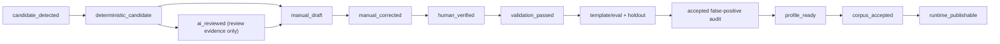
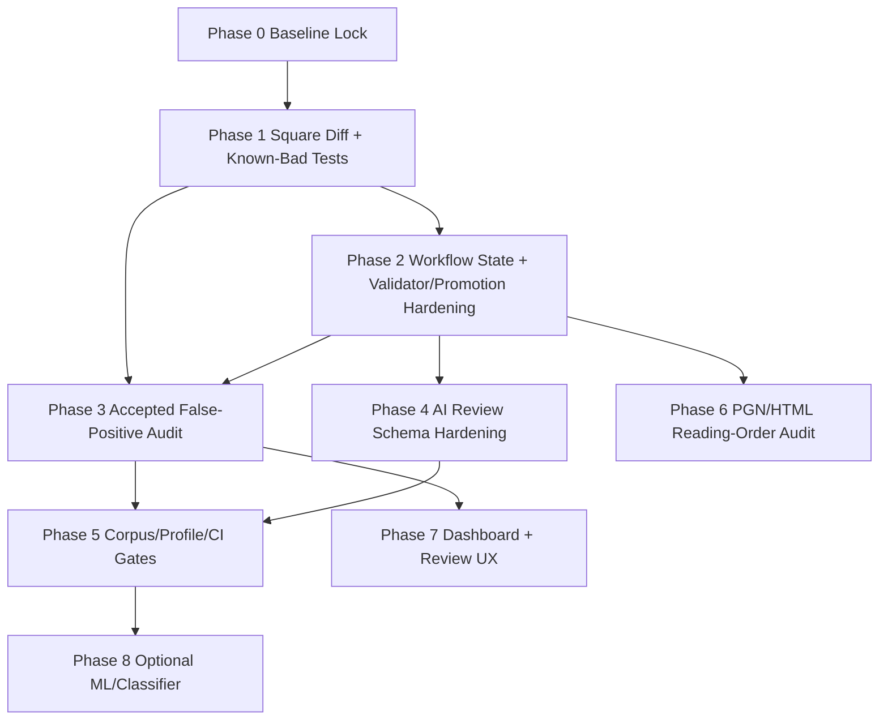

# Chess FEN/PGN Hardening Execution Roadmap

> **For agentic workers:** REQUIRED SUB-SKILL: Use `superpowers:subagent-driven-development` for parallel PR-sized workstreams, or `superpowers:executing-plans` for inline execution. Steps use checkbox (`- [ ]`) syntax for tracking.

**Goal:** Merge the specialist FEN/PGN/HTML hardening plans into one safe execution roadmap that prevents false verified labels, false published FEN, unsafe AI promotion, broken PGN export, and semantically wrong chess-book HTML.

**Architecture:** Build a staged safety system around the existing KindleMaster chess pipeline: canonical FEN state/provenance, deterministic square-level diff, validator/promotion gates, accepted false-positive audit, AI review-only schema hardening, corpus/CI release gates, and reading-order/PGN HTML audits. Runtime publication remains conservative: AI can suggest and prioritize review, but only deterministic validation and human-verified crop-backed labels can become corpus/runtime evidence.

**Tech Stack:** Python stdlib, existing `unittest`, existing JSON/JSONL reports, `python-chess`, Pillow for audit overlays where already acceptable, existing OpenAI Responses integration, existing GitHub Actions READY workflow.

---

## 1. Executive Summary

The specialist plans converge on one central risk: a FEN/PGN/HTML artifact can look confident while being semantically wrong. The known class is `p010_d002`, where a candidate visually mistakes a black rook on `e5` for a black pawn. Therefore, the program must treat confidence, AI approval, arbiter approval, and syntactic FEN validity as evidence only, not authority.

Critical execution order:

1. Establish square-level diff and known-bad regression fixtures.
2. Formalize state/provenance so `ai_reviewed` cannot become `verified`.
3. Harden label validation and promotion.
4. Export accepted/high-confidence false-positive audit queues.
5. Upgrade AI schema to detailed review-only evidence.
6. Tighten corpus/profile/CI gates.
7. Add chess HTML/PGN reading-order audits.
8. Add optional review UI, ML, and advanced dashboards only after safety gates are stable.

The first release should intentionally prefer more `needs_review` output over any false accepted FEN or PGN. The second release can improve acceptance rates after verified labels and audit evidence exist.

## 2. Consolidated Target Architecture

### Authority Model

- AI/OpenAI/DeepSeek outputs are `review_signal_only`.
- Human visual confirmation creates `human_verified` evidence, but not corpus acceptance by itself.
- `validate_fen()` plus `python-chess` structural validation creates `validation_passed`.
- Template/eval/holdout/false-positive audit creates `profile_ready`.
- Corpus manifest/profile gate creates `corpus_accepted`.
- Runtime publication requires deterministic recognizer gates or exact-crop verified-label hash match.

### Canonical Flow



Forbidden transitions:

- `ai_reviewed -> human_verified`
- `ai_reviewed -> validation_passed`
- `ai_reviewed -> corpus_accepted`
- `ai_reviewed -> runtime_publishable`
- `high_confidence -> verified`
- `arbiter_approved -> verified`

### Core Shared Primitives

- `chess_fen_workflow.py`: canonical state constants, adapters, and transition validation.
- `chess_fen_hardening.py`: square-level FEN diff, known-bad fixtures, AI-only provenance helpers.
- `scripts/export_chess_fen_accepted_audit.py`: accepted/high-confidence audit queue.
- `scripts/validate_chess_fen_labels.py`: verified-label hard gate.
- `scripts/promote_chess_fen_label_draft.py`: manual-only promotion.
- `openai_chess_fen_reviewer.py`: review-only AI schema.
- `chess_reading_order_audit.py` or `scripts/audit_chess_reading_order.py`: semantic HTML/PGN/diagram reading-order audit.

## 3. Dependency Graph Between Tasks



Parallel-safe work:

- Phase 1 square diff can run in parallel with Phase 0 baseline documentation after file ownership is assigned.
- Phase 3 accepted audit skeleton can start once Phase 1 API signatures are stable.
- Phase 4 AI schema parser compatibility can run while Phase 2 validator hardening is underway, as long as import remains review-only.
- Phase 6 HTML/PGN reading-order audit can run after state names are agreed, and does not need to wait for corpus CI gates.

Sequential dependencies:

- Validator/promotion hardening must wait for state/diff vocabulary.
- Corpus/profile gates must wait for validator hardening and accepted audit outputs.
- ML/classifier work must wait for verified label dataset and gate semantics.

## 4. PR-Sized Implementation Phases

### Phase 0: Baseline Lock And Plan Alignment

**Priority:** Critical  
**Purpose:** Freeze current behavior and confirm which hardening pieces already exist before deeper changes.

**Files likely to modify:**

- `docs/chess-study-data-contracts.md`
- `reports/` generated locally only, not committed unless explicitly source-controlled
- `docs/superpowers/plans/2026-06-14-chess-fen-pgn-hardening-execution-roadmap.md`

**Tasks:**

- [ ] Run current FEN/PGN quality dashboard locally and record counts in a generated baseline report.
- [ ] Inventory current plan-claimed completed items against actual code.
- [ ] Document current artifact contracts: review queue, AI assist, verified labels, profile eval, PGN review, HTML reader audit.
- [ ] Mark generated outputs as evidence, not source of truth.

**Tests per phase:**

- [ ] No tests required for docs-only baseline.
- [ ] If any command wrappers are touched, run `python kindlemaster.py test --suite quick`.

**CI gates per phase:**

- [ ] No CI behavior change.

**Acceptance criteria:**

- [ ] Baseline counts for diagrams, AI candidates, verified labels, accepted FEN, PGN records, accepted PGN are recorded.
- [ ] Existing hardening features are classified as present, partial, or missing.

### Phase 1: Square-Level Diff And Known-Bad Regression Fixtures

**Priority:** Critical  
**Purpose:** Create the deterministic vocabulary for saying exactly what is visually wrong, e.g. `p010_d002: e5 black rook, not black pawn`.

**Files likely to modify:**

- `chess_fen_hardening.py`
- `test_chess_fen_square_diff.py`
- `test_chess_fen_pipeline_hardening.py`
- `test_chess_fen_recognition.py`

**Tasks:**

- [ ] Expand canonical FEN placement parser into `fen_placement_to_square_map()`.
- [ ] Add piece-name helper for all 12 pieces plus empty square.
- [ ] Add `compare_fen_placements(candidate_fen, expected_fen)`.
- [ ] Add text/JSON/HTML diff renderers.
- [ ] Add full-FEN compare that separates side-to-move differences from placement differences.
- [ ] Add synthetic `p010_d002`-style test where candidate has black pawn on `e5` and expected has black rook.
- [ ] Preserve backward compatibility for existing `square_level_fen_diff()` callers.

**Tests per phase:**

- [ ] `python -m unittest test_chess_fen_square_diff.py`
- [ ] `python -m unittest test_chess_fen_pipeline_hardening.py test_chess_fen_recognition.py`

**CI gates per phase:**

- [ ] Quick unit gate must include the new square-diff tests.

**Acceptance criteria:**

- [ ] Diff renders `p010_d002: e5 black rook, not black pawn`.
- [ ] Invalid FEN is reported as error, not as exact match.
- [ ] Side-to-move-only differences do not create square diffs.
- [ ] No AI is required for diff generation.

### Phase 2: Workflow State Model, Validator, And Promotion Hardening

**Priority:** Critical  
**Purpose:** Make state transitions explicit and block AI/high-confidence/manual-draft records from becoming verified without human visual evidence.

**Files likely to modify:**

- `chess_fen_workflow.py`
- `docs/schemas/chess-fen-workflow-record.schema.json`
- `docs/chess-study-data-contracts.md`
- `scripts/export_chess_fen_review_queue.py`
- `scripts/build_chess_fen_label_aids.py`
- `scripts/import_chess_fen_label_assist.py`
- `scripts/promote_chess_fen_label_draft.py`
- `scripts/validate_chess_fen_labels.py`
- `scripts/check_chess_fen_profile_ready.py`
- `test_chess_fen_workflow_state_model.py`
- `test_chess_fen_pipeline_hardening.py`
- `test_chess_fen_recognition.py`

**Tasks:**

- [ ] Add canonical `workflow_state` values and lightweight `TypedDict`/validator helpers.
- [ ] Add legacy adapter mapping existing fields to canonical states.
- [ ] Add JSON Schema for workflow records.
- [ ] Emit `workflow_state` and `schema_version` from review queue, label-aids, and AI-assist import.
- [ ] Require `label_status == "verified"` for non-legacy verified labels.
- [ ] Require `human_verified=true`, `verification_source=human_visual`, `verified_by`, `verified_at`, crop path, crop hash, and square-diff acknowledgement.
- [ ] Reject unresolved `ai_requires_review`, `ai_ambiguous_squares`, blocker `ai_issues`, review-only statuses, and AI-only provenance.
- [ ] Add `python-chess` structural validation layer with blocker/warning classification.
- [ ] Keep `--accept-ai-suggestions` as removed or no-op compatibility behavior that cannot alter output.

**Tests per phase:**

- [ ] `python -m unittest test_chess_fen_workflow_state_model.py`
- [ ] `python -m unittest test_chess_fen_pipeline_hardening.py test_chess_fen_recognition.py`
- [ ] `python -m py_compile chess_fen_workflow.py scripts\\promote_chess_fen_label_draft.py scripts\\validate_chess_fen_labels.py`

**CI gates per phase:**

- [ ] Quick suite must fail if AI approval, arbiter approval, or high confidence can promote a label.

**Acceptance criteria:**

- [ ] `ai_approved=True` cannot produce `label_status=verified`.
- [ ] `arbiter_approved=True` cannot produce `label_status=verified`.
- [ ] High confidence cannot produce `label_status=verified`.
- [ ] A complete human-verified synthetic label passes.
- [ ] Known-bad `p010_d002` remains blocked even if other metadata looks valid.

### Phase 3: Accepted/High-Confidence False-Positive Audit

**Priority:** Critical  
**Purpose:** Catch the dangerous class that does not enter ordinary review because it appears accepted or high-confidence.

**Files likely to modify:**

- `scripts/export_chess_fen_accepted_audit.py`
- `test_chess_fen_accepted_audit.py`
- `test_smoke_chess_quality.py`
- `docs/chess-study-data-contracts.md`

**Tasks:**

- [ ] Add audit-only exporter for `accepted_audit_queue.json`, `accepted_audit_queue.jsonl`, `accepted_audit_review.html`, and `accepted_audit_summary.json`.
- [ ] Include all `requires_review` records.
- [ ] Include deterministic samples of accepted/high-confidence records.
- [ ] Include accepted records with high-risk warnings, low-corpus profiles, inferred side-to-move, crop/grid issues, dense crop fallback, and risky piece-confusion patterns.
- [ ] Always include known-bad fixture classes such as `p010_d002`.
- [ ] Copy crops and generate grid overlays when possible.
- [ ] Keep exporter audit-only; it must not mutate labels, EPUB, HTML, PGN, corpus, or runtime publication.

**Tests per phase:**

- [ ] `python -m unittest test_chess_fen_accepted_audit.py`
- [ ] `python -m unittest test_chess_fen_pipeline_hardening.py test_smoke_chess_quality.py`
- [ ] `python -m py_compile scripts\\export_chess_fen_accepted_audit.py`

**CI gates per phase:**

- [ ] Quick gate runs synthetic accepted-audit tests.
- [ ] Release gate can upload audit artifacts later, but v1 exporter is report-only.

**Acceptance criteria:**

- [ ] Accepted/high-confidence rows are sampled deterministically.
- [ ] `p010_d002` appears as critical when present.
- [ ] AI-approved or arbiter-approved records without human verification are high-risk audit candidates.
- [ ] Missing crop is reported but does not crash export.

### Phase 4: OpenAI/AI FEN Review Schema Hardening

**Priority:** Important  
**Purpose:** Preserve AI usefulness while removing authority-like semantics and requiring square-level uncertainty evidence.

**Files likely to modify:**

- `openai_chess_fen_reviewer.py`
- `scripts/export_chess_fen_review_queue.py`
- `scripts/build_chess_fen_label_aids.py`
- `scripts/import_chess_fen_label_assist.py`
- `test_chess_fen_recognition.py`
- `docs/chess-study-data-contracts.md`

**Tasks:**

- [ ] Add v2 AI candidate/review schema with `square_diffs`, structured `side_to_move`, `cannot_verify_reason`, `evidence_level`, `crop_quality_notes`, and `policy_acknowledgement`.
- [ ] Normalize legacy `approved` and `corrected_fen` into review-only `review_opinion` and `ai_suggested_fen`.
- [ ] Forbid model authority fields: `verified`, `accepted`, `accepted_for_corpus`, `label_status`, `verified_by`, `verified_at`.
- [ ] Store all AI output under `ai_*`.
- [ ] Keep `fen`, `verified_by`, `verified_at`, and `accepted_for_corpus` unchanged/empty during AI import.
- [ ] Preserve AI square diffs and notes even when AI FEN is invalid.

**Tests per phase:**

- [ ] `python -m unittest test_chess_fen_recognition.py`
- [ ] `python -m py_compile openai_chess_fen_reviewer.py scripts\\export_chess_fen_review_queue.py scripts\\import_chess_fen_label_assist.py`

**CI gates per phase:**

- [ ] Provider/import tests must pass without live API calls.

**Acceptance criteria:**

- [ ] AI can express `e5 candidate black pawn, observed black rook`.
- [ ] AI schema remains review-only.
- [ ] Import cannot set verified/corpus/runtime fields from AI output.
- [ ] Ambiguous occupied squares force manual review evidence.

### Phase 5: Corpus/Profile/CI Gate Tightening

**Priority:** Important  
**Purpose:** Prevent a weak or one-profile recognizer from being treated as release-ready.

**Files likely to modify:**

- `scripts/evaluate_chess_fen_recognizer.py`
- `scripts/evaluate_chess_fen_corpus.py`
- `scripts/evaluate_chess_fen_profile_holdout.py`
- `scripts/check_chess_fen_profile_ready.py`
- `scripts/run_corpus_gate.py`
- `kindlemaster.py`
- `.github/workflows/ready-enforcement.yml`
- `test_chess_fen_recognition.py`
- `test_corpus_gate.py`
- `test_kindlemaster_entrypoint.py`
- `test_github_ready_enforcement.py`
- `reference_inputs/manifest.json` only when adding a second real scanned profile

**Tasks:**

- [ ] Split dev quick proof from release/corpus proof.
- [ ] Require `false_positive_count == 0` for every strict FEN gate.
- [ ] Require exact FEN accuracy `>= 0.90`.
- [ ] Require at least `20` verified labels per profile.
- [ ] Require at least `2` real scanned profiles for release/corpus proof.
- [ ] Require holdout evaluation for profile readiness.
- [ ] Require accepted false-positive audit before profile readiness in release mode.
- [ ] Add actionable failure reports with next actions, per-profile reasons, per-piece confusion, and square diffs.
- [ ] Keep quick CI bounded and independent of private PDFs.

**Tests per phase:**

- [ ] `python -m unittest test_chess_fen_recognition.py test_corpus_gate.py test_kindlemaster_entrypoint.py test_github_ready_enforcement.py`
- [ ] `python -m py_compile scripts\\evaluate_chess_fen_recognizer.py scripts\\evaluate_chess_fen_corpus.py scripts\\evaluate_chess_fen_profile_holdout.py scripts\\check_chess_fen_profile_ready.py scripts\\run_corpus_gate.py kindlemaster.py`

**CI gates per phase:**

- [ ] Quick lane remains `python kindlemaster.py test --suite quick`.
- [ ] Release lane exposes FEN corpus proof.
- [ ] Hard `min_profile_count=2` gate activates only when the second committed scanned profile exists, or fails with clear expected reason in transition.

**Acceptance criteria:**

- [ ] One-profile release proof fails with actionable next action.
- [ ] False positive fails even if exact accuracy threshold passes.
- [ ] Holdout failure blocks profile readiness.
- [ ] Font-board review candidates do not count as strict scanned profiles.

### Phase 6: Chess HTML/PGN Reading-Order Audit

**Priority:** Important  
**Purpose:** Prevent technically valid but semantically wrong chess EPUB/HTML ordering.

**Files likely to modify:**

- `chess_reading_order_audit.py` or `scripts/audit_chess_reading_order.py`
- `pymupdf_chess_extractor.py`
- `chess_pgn_extractor.py`
- `publication_pipeline.py`
- `converter.py`
- `epub_text_artifacts.py`
- `test_chess_pgn_extraction.py`
- `test_chess_notation_reflow.py`
- `test_chess_notation_regression.py`
- `test_publication_pipeline.py`
- `test_smoke_chess_quality.py`

**Tasks:**

- [ ] Add `ChessReadingOrderReport`, `ChessReadingOrderPage`, `ChessReadingOrderElement`, and `ChessDiagramPgnLink` report model.
- [ ] Emit `html_reading_order_report.json` and `html_reading_order_report.html`.
- [ ] Report per-page text blocks, diagram ids, crop paths, PGN blocks, FEN candidates, warnings, and link confidence.
- [ ] Detect detached diagrams, PGN source-page mismatch, continuation risk, caption inversion, and visible OCR junk.
- [ ] Audit PGN comments, variations, move-number/prose separation, continuation across pages, castling, promotion, check/mate, figurines, and OCR artifact cleanup traces.
- [ ] Check Kindle HTML for image dimensions, alt text, copyable accepted FEN/PGN, hidden review metadata, no local paths, and mobile/Kindle overflow risk.

**Tests per phase:**

- [ ] `python -m unittest test_chess_pgn_extraction.py test_chess_notation_reflow.py test_chess_notation_regression.py test_publication_pipeline.py test_smoke_chess_quality.py`
- [ ] `python -m py_compile chess_pgn_extractor.py pymupdf_chess_extractor.py publication_pipeline.py converter.py`

**CI gates per phase:**

- [ ] Quick unit tests cover synthetic reading-order fixtures.
- [ ] Release/corpus smoke can optionally emit reading-order audit reports after v1 stabilizes.

**Acceptance criteria:**

- [ ] Report proves source order per page.
- [ ] Diagram/FEN/PGN links include match strategy and confidence.
- [ ] PGN review-only content is never exposed as accepted/copyable strict PGN.
- [ ] Final HTML has no `localhost`, `127.0.0.1`, `file://`, or absolute local paths.

### Phase 7: Dashboard And Review UX

**Priority:** Optional  
**Purpose:** Make manual verification faster without weakening gates.

**Files likely to modify:**

- `chess_study_export.py`
- `scripts/export_chess_fen_review_queue.py`
- `scripts/export_chess_fen_accepted_audit.py`
- `docs/chess-study-data-contracts.md`
- review HTML templates generated by current scripts

**Tasks:**

- [ ] Add `fen_square_diff_review.html` with crop, normalized board, AI candidate, deterministic candidate, manual FEN, and square-diff table.
- [ ] Add `accepted_audit_review.html` filtering for high/critical risk.
- [ ] Add quality dashboard fields: human-verified labels, AI-only candidates, square-diff failures, accepted audit status, profile readiness blockers, PGN replay blockers, and reading-order warnings.
- [ ] Keep all UI edits export-only; browser UI cannot mutate corpus labels without explicit export/import workflow.

**Tests per phase:**

- [ ] HTML snapshot/BeautifulSoup tests for review cards and escaped values.
- [ ] Dashboard JSON schema tests.

**CI gates per phase:**

- [ ] Optional artifact tests in quick suite if fast.

**Acceptance criteria:**

- [ ] Human can see one-square mismatches without manually parsing FEN.
- [ ] UI never labels AI evidence as verified.
- [ ] Dashboard answers why FEN/PGN is not accepted yet.

### Phase 8: Optional ML/Classifier Helper

**Priority:** Optional  
**Purpose:** Improve acceptance rate after sufficient verified labels exist.

**Files likely to modify:**

- `chess_study_export.py`
- `chess_position_recognizer.py`
- `kindlemaster.py`
- New model/dataset helpers under existing project conventions
- `test_chess_fen_model_pipeline.py`

**Tasks:**

- [ ] Build square dataset only from verified crop-backed labels.
- [ ] Train optional per-square classifier after `50-100` verified FEN labels.
- [ ] Export model metadata and corpus manifest.
- [ ] Use model only inside an ensemble gate with template + chess rules.
- [ ] Conflict or low confidence remains `needs_review`.

**Tests per phase:**

- [ ] Dataset split tests preventing holdout leakage.
- [ ] Missing model fallback tests.
- [ ] Ensemble conflict review-only tests.

**CI gates per phase:**

- [ ] Training is manual workflow only.
- [ ] Runtime tests must pass without model files.

**Acceptance criteria:**

- [ ] Model cannot set accepted without deterministic validation.
- [ ] False accepted on holdout remains zero before any release claim.

## 5. Exact Order Of Execution

1. [ ] Phase 0: baseline and artifact inventory.
2. [ ] Phase 1: square-level diff API and known-bad tests.
3. [ ] Phase 2: workflow state model and validator/promotion hardening.
4. [ ] Phase 3: accepted/high-confidence false-positive audit.
5. [ ] Phase 4: AI review schema hardening.
6. [ ] Phase 5: corpus/profile/CI gate tightening.
7. [ ] Phase 6: chess HTML/PGN reading-order audit.
8. [ ] Phase 7: review UX/dashboard upgrades.
9. [ ] Phase 8: optional ML/classifier helper.

If agent capacity is available, execute Phase 4 and Phase 6 in parallel after Phase 2 establishes state names. Do not run Phase 5 before Phase 3 audit outputs exist.

## 6. Parallel Work Allocation

### Parallel Group A: Critical Foundation

- [ ] Agent A: square diff API and tests.
- [ ] Agent B: workflow state schema/adapters.
- [ ] Agent C: known-bad regression fixtures.

Synchronization point:

- [ ] Agree on `SquareDiff` field names and `workflow_state` constants.

### Parallel Group B: Safety Gates

- [ ] Agent D: validator/promotion hardening.
- [ ] Agent E: accepted false-positive audit.
- [ ] Agent F: AI schema parser compatibility.

Synchronization point:

- [ ] Validator consumes `SquareDiff`, workflow state, and AI review-only fields consistently.

### Parallel Group C: Product/Release Evidence

- [ ] Agent G: corpus/profile/CI gates.
- [ ] Agent H: HTML/PGN reading-order audit.
- [ ] Agent I: dashboard/review UX.

Synchronization point:

- [ ] Dashboard can aggregate FEN audit, PGN replay, and reading-order summaries.

## 7. Tests Per Phase Summary

- Phase 1: `test_chess_fen_square_diff.py`, `test_chess_fen_pipeline_hardening.py`.
- Phase 2: `test_chess_fen_workflow_state_model.py`, `test_chess_fen_recognition.py`.
- Phase 3: `test_chess_fen_accepted_audit.py`, `test_smoke_chess_quality.py`.
- Phase 4: `test_chess_fen_recognition.py` provider/import cases.
- Phase 5: `test_corpus_gate.py`, `test_kindlemaster_entrypoint.py`, `test_github_ready_enforcement.py`.
- Phase 6: `test_chess_pgn_extraction.py`, `test_chess_notation_reflow.py`, `test_chess_notation_regression.py`, `test_publication_pipeline.py`.
- Phase 7: HTML/report schema tests.
- Phase 8: `test_chess_fen_model_pipeline.py`.

Full checkpoint command after critical phases:

```powershell
python -m unittest test_chess_fen_square_diff.py test_chess_fen_workflow_state_model.py test_chess_fen_pipeline_hardening.py test_chess_fen_recognition.py test_chess_fen_accepted_audit.py
```

Broader checkpoint command after Phase 6:

```powershell
python -m unittest test_chess_pgn_extraction.py test_chess_notation_reflow.py test_chess_notation_regression.py test_publication_pipeline.py test_smoke_chess_quality.py
```

## 8. CI Gates Per Phase

- [ ] Phase 1 gate: square diff and known-bad tests in quick suite.
- [ ] Phase 2 gate: AI/high-confidence cannot promote; validator rejects review-only labels.
- [ ] Phase 3 gate: accepted audit tests pass; exporter remains audit-only.
- [ ] Phase 4 gate: AI schema tests use fake responses only; no live API in CI.
- [ ] Phase 5 gate: release lane exposes FEN corpus proof; strict two-profile gate enabled only when committed fixtures support it.
- [ ] Phase 6 gate: reading-order synthetic tests pass; no final HTML local paths.
- [ ] Phase 7 gate: generated review HTML escapes values and does not mutate data.
- [ ] Phase 8 gate: model runtime degrades gracefully without model files.

## 9. Program-Level Acceptance Criteria

- [ ] No path converts AI approval, arbiter approval, or high confidence into `verified`.
- [ ] Every new verified FEN label has human provenance, crop evidence, crop hash, square-diff acknowledgement, valid six-field FEN, valid kings, and `python-chess` blocker-free status.
- [ ] `p010_d002` pawn/rook mismatch remains permanently blocked and appears in audit evidence.
- [ ] Accepted/high-confidence false-positive audit can sample and report accepted-looking rows.
- [ ] Profile/corpus gates fail on false positives even when exact accuracy threshold passes.
- [ ] Release/corpus proof requires at least two real scanned profiles when making generalization claims.
- [ ] AI schema captures uncertainty and square-level disagreements but cannot mutate label/corpus/runtime fields.
- [ ] PGN strict export remains parser/replay gated.
- [ ] Chess HTML/PGN audit proves reading order and link quality rather than assuming generated layout is semantically correct.
- [ ] Final chess EPUB/HTML does not expose local paths, empty copy controls, or review-only junk as accepted output.

## 10. Rollback Strategy

- Implement additive reports before hard failures.
- Keep legacy field adapters until new artifacts are widely emitted.
- If validator hardening overblocks existing known-good labels, add migration metadata instead of weakening AI-safety rules.
- If CI strict profile count fails because only one real scanned profile exists, keep the strict command as documented local release proof and defer hard CI switch until the second fixture lands.
- If reading-order audit is noisy, tune warning thresholds without changing strict PGN/FEN export.
- If runtime publication regresses, rollback runtime integration only; preserve audit scripts, tests, and documentation.
- Always prefer review-only output over false accepted FEN/PGN.

## 11. Risks And Mitigations

- Risk: Existing local labels lack new provenance fields.
  - Mitigation: support legacy adapter with warnings; require new labels to follow the strict contract.

- Risk: Square diff parameter order is misunderstood.
  - Mitigation: tests require manual/expected truth first in rendered text.

- Risk: AI schema drift adds authoritative fields.
  - Mitigation: parser drops forbidden fields and records `ai_authoritative_field_ignored`.

- Risk: Accepted audit creates too many cards.
  - Mitigation: deterministic sampling plus always-include high-risk categories.

- Risk: `python-chess` overblocks legitimate study positions.
  - Mitigation: treat structural impossibilities as blockers and history/metadata concerns as warnings.

- Risk: CI cannot enforce two-profile proof yet.
  - Mitigation: stage the hard gate and require clear failure/next-action reporting until the second committed profile exists.

- Risk: Reading-order audit over-warns on exercises/solutions.
  - Mitigation: report distances, match strategy, and confidence rather than binary pass/fail only.

- Risk: Optional ML creates false optimism.
  - Mitigation: ML stays behind verified dataset, holdout, ensemble, and deterministic validation gates.

## 12. Definition Of Done For The Whole Program

- [ ] Critical phases 1-3 are implemented and tested.
- [ ] Important phases 4-6 are implemented or explicitly split into tracked follow-up PRs with gates preserved.
- [ ] All new artifacts have documented schemas or data contracts.
- [ ] Quick suite passes without live API calls.
- [ ] Release/corpus gate reports FEN readiness honestly, including missing two-profile proof if not yet available.
- [ ] No AI-only or high-confidence-only record can become verified/corpus/runtime publishable.
- [ ] Accepted false-positive audit, square-level diff, validator, profile gate, and known-bad regression tests all agree on `p010_d002`.
- [ ] PGN export remains clean: only parser/replay-valid records are copyable/exported as strict PGN.
- [ ] HTML/PGN reading-order audit exposes whether book order is semantically correct.
- [ ] Rollback path is documented for every phase.
- [ ] Final dashboard/report can answer: current accepted FEN, accepted PGN, false-positive risk, top blockers, and next action.
