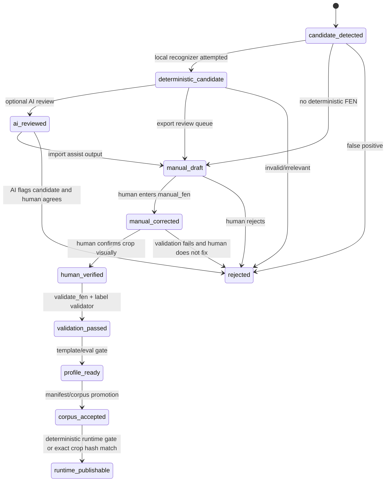

# FEN Workflow State Model Implementation Plan

> **For agentic workers:** REQUIRED SUB-SKILL: Use superpowers:subagent-driven-development (recommended) or superpowers:executing-plans to implement this plan task-by-task. Steps use checkbox (`- [ ]`) syntax for tracking.

**Goal:** Replace the implicit chess FEN review/corpus workflow with an explicit state machine and canonical data contract that keeps AI review evidence separate from human verification, corpus acceptance, and runtime publication.

**Architecture:** Add a small internal state/model layer around the existing JSONL workflow rather than adding a new runtime dependency. The canonical record should be represented as `TypedDict` definitions plus a lightweight validator/state-transition helper, with JSON Schema export for docs/tooling and backwards-compatible adapters for current fields.

**Tech Stack:** Python standard library, `typing.TypedDict`, existing JSONL scripts, existing `validate_fen()` and hardening helpers, existing `unittest` suite.

---

## 1. Current State Findings With File References

### Runtime FEN recognition and validation

- `chess_position_recognizer.py:105` defines `ChessFenResult`, the runtime recognition result shape: `fen`, `placement`, `confidence`, `side_to_move`, `bbox`, `method`, `warnings`, `requires_review`, `board_detected`, and `squares`.
- `chess_position_recognizer.py:197` defines `validate_fen(fen)`, which enforces six fields, board width, one king per side, side-to-move, castling/en-passant format, and move counters.
- `chess_position_recognizer.py:556` defines `review_chess_fen_candidate()`, which calls an optional provider and records review metadata without mutating `ChessFenResult`.
- `chess_position_recognizer.py:584` summarizes FEN records by counting records with non-empty `fen`.

Finding: runtime already has a useful distinction between recognized/publishable FEN and `requires_review`, but that distinction is not the same as corpus label verification. The state model must keep `runtime_publishable` separate from `corpus_accepted`.

### OpenAI / AI review-only contract

- `openai_chess_fen_reviewer.py:24` defines `OpenAIChessFenReviewer`.
- `openai_chess_fen_reviewer.py:34` returns AI FEN candidates from diagram crops with `mode="review_only"`, `mutates_fen=False`, and `changed_output=False`.
- `openai_chess_fen_reviewer.py:71` reviews deterministic candidates and returns `candidate_fen`, `suggested_label`, `approved`, `review_opinion`, `requires_review`, confidence, issues, and ambiguous squares.
- `openai_chess_fen_reviewer.py:82` still parses the legacy `approved` boolean.
- `openai_chess_fen_reviewer.py:91` maps `corrected_fen` to `suggested_label`.
- `openai_chess_fen_reviewer.py:93` adds `review_opinion`, which is safer than treating `approved` as authority.
- `openai_chess_fen_reviewer.py:339` keeps the current review schema fields `approved` and `corrected_fen` for compatibility.

Finding: the provider is explicitly review-only and already avoids output mutation. The remaining risk is semantic: old field names such as `approved` and `corrected_fen` can be misunderstood outside the provider.

### Review queue and manual draft generation

- `scripts/export_chess_fen_review_queue.py:24` exports unresolved scanned-board FEN cases and states it never writes labels or mutates EPUB output.
- `scripts/export_chess_fen_review_queue.py:158` builds per-item `candidate_fen` from deterministic placement when syntactically valid.
- `scripts/export_chess_fen_review_queue.py:446` builds manual verification draft rows.
- `scripts/export_chess_fen_review_queue.py:458` writes `deterministic_suggested_fen`.
- `scripts/export_chess_fen_review_queue.py:464` sets `label_status="needs_manual_fen"`.
- `scripts/export_chess_fen_review_queue.py:467` sets `accepted_for_corpus=False`.

Finding: the review queue already has the right safety posture, but it uses several candidate fields without one canonical state field.

### Label aids

- `scripts/build_chess_fen_label_aids.py:27` builds visual aids for candidate labels.
- `scripts/build_chess_fen_label_aids.py:67` carries `candidate_fen`.
- `scripts/build_chess_fen_label_aids.py:79` writes `manual_label_template.jsonl`.
- `scripts/build_chess_fen_label_aids.py:93` and `scripts/build_chess_fen_label_aids.py:199` set `accepted_for_corpus=False`.
- `scripts/build_chess_fen_label_aids.py:170` and `scripts/build_chess_fen_label_aids.py:171` leave `verified_by` and `verified_at` empty in manual templates.

Finding: label aids are correctly review-only. They should become `manual_draft` state records in the canonical model.

### AI label-assist import

- `scripts/import_chess_fen_label_assist.py:16` imports label-assist responses.
- `scripts/import_chess_fen_label_assist.py:25` documents that `ai_suggested_fen` is separate and `fen`, `verified_by`, and `verified_at` remain empty.
- `scripts/import_chess_fen_label_assist.py:75` writes `ai_suggested_fen`.
- `scripts/import_chess_fen_label_assist.py:76` writes `ai_approved`.
- `scripts/import_chess_fen_label_assist.py:77` writes `ai_review_opinion`.
- `scripts/import_chess_fen_label_assist.py:84` sets `label_status="needs_manual_fen"`.
- `scripts/import_chess_fen_label_assist.py:88` sets `accepted_for_corpus=False`.

Finding: the import path is safe, but `ai_approved` and `ready_for_manual_verification_count` should be documented as review prioritization only, not workflow state advancement.

### Draft promotion

- `scripts/promote_chess_fen_label_draft.py:19` promotes manual draft rows into validator-ready labels.
- `scripts/promote_chess_fen_label_draft.py:64` always sets `accepted_for_corpus=False`.
- `scripts/promote_chess_fen_label_draft.py:103` requires `human_verified`.
- `scripts/promote_chess_fen_label_draft.py:109` requires square-diff acknowledgement.
- `scripts/promote_chess_fen_label_draft.py:112` reads only `fen` or `manual_fen`.
- `scripts/promote_chess_fen_label_draft.py:115` and `scripts/promote_chess_fen_label_draft.py:117` explicitly ignore AI and deterministic suggestions when `manual_fen` is absent.
- `scripts/promote_chess_fen_label_draft.py:135` writes `crop_sha256`.
- `scripts/promote_chess_fen_label_draft.py:139` writes `verification_source="human_visual"`.
- `scripts/promote_chess_fen_label_draft.py:140` writes `human_verified=True`.
- `scripts/promote_chess_fen_label_draft.py:143` writes `label_status="verified"`.

Finding: recent hardening made promotion substantially safer. The state model should preserve this behavior while replacing overloaded `label_status` meanings with explicit workflow state.

### Label validation and profile/corpus gate

- `scripts/validate_chess_fen_labels.py:29` validates verified label JSONL files.
- `scripts/validate_chess_fen_labels.py:85` rejects missing `fen`.
- `scripts/validate_chess_fen_labels.py:105` and `scripts/validate_chess_fen_labels.py:109` reject missing verifier provenance.
- `scripts/validate_chess_fen_labels.py:115` rejects review-only `label_status`.
- `scripts/validate_chess_fen_labels.py:121` infers `verification_source`.
- `scripts/validate_chess_fen_labels.py:125` rejects AI-only verification source.
- `scripts/validate_chess_fen_labels.py:131` rejects missing `human_verified` for non-legacy rows.
- `scripts/validate_chess_fen_labels.py:134` rejects missing square-diff acknowledgement for non-legacy rows.
- `scripts/validate_chess_fen_labels.py:136` through `scripts/validate_chess_fen_labels.py:143` enforce crop hash when available.
- `scripts/validate_chess_fen_labels.py:146` blocks AI suggestions promoted as labels.
- `scripts/check_chess_fen_profile_ready.py:55` requires label validation before profile readiness.
- `scripts/check_chess_fen_profile_ready.py:66` enforces minimum seed label count.
- `scripts/check_chess_fen_profile_ready.py:91` fails when recognizer evaluation fails.
- `scripts/check_chess_fen_profile_ready.py:103` sets `accepted_for_corpus=True` only when profile status is ready.

Finding: the validator already encodes many desired invariants, but scripts still speak in mixed terms: `label_status`, `accepted_for_corpus`, validator pass, profile ready, and runtime publishability.

### Tests

- `test_chess_fen_recognition.py:1861` covers manual approval requirement for promotion.
- `test_chess_fen_recognition.py:1899` and `test_chess_fen_recognition.py:1945` cover blocking AI/deterministic suggestions when manual FEN is missing.
- `test_chess_fen_recognition.py:1987`, `test_chess_fen_recognition.py:2045`, and `test_chess_fen_recognition.py:2114` cover profile readiness paths.
- `test_chess_fen_recognition.py:3335` and `test_chess_fen_recognition.py:3366` cover verified exact-crop runtime publication and hash mismatch.
- `test_chess_fen_recognition.py:4079` through `test_chess_fen_recognition.py:4201` cover OpenAI review-only behavior.
- `test_chess_fen_pipeline_hardening.py:16`, `test_chess_fen_pipeline_hardening.py:84`, and `test_chess_fen_pipeline_hardening.py:118` cover square diff, known bad `p010_d002`, and AI suggestion promotion blocking.

Finding: regression coverage exists for many safety rules. The missing tests are state-transition tests and schema compatibility tests.

## 2. Proposed State Machine

### Canonical states

Use one canonical field:

```text
workflow_state
```

Allowed values:

1. `candidate_detected`
   - A diagram/crop/candidate record exists.
   - May include `crop_path`, `bbox`, page metadata, and raw recognizer placement.
   - No FEN authority.

2. `deterministic_candidate`
   - Local recognizer produced `deterministic_suggested_fen` or `candidate_fen`.
   - May be syntactically valid or invalid.
   - Does not imply verified, accepted, or publishable.

3. `ai_reviewed`
   - AI added `ai_suggested_fen`, `ai_review_opinion`, `ai_confidence`, issues, and ambiguous squares.
   - `ai_approved=True`, `arbiter_approved=True`, or high confidence still means only “review signal”.

4. `manual_draft`
   - A row is ready for human work.
   - May contain AI/deterministic suggestions, crop aid, square-diff candidate, and empty `manual_fen`.
   - Not valid for corpus or runtime publication.

5. `manual_corrected`
   - Human entered `manual_fen` or copied a candidate into `manual_fen` after visual inspection.
   - Still not verified until explicit confirmation and evidence are present.

6. `human_verified`
   - Human explicitly confirmed the board visually.
   - Requires `human_verified=True`, `verification_source="human_visual"`, `verified_by`, `verified_at`, crop-backed evidence, and square-diff acknowledgement.
   - Still not profile/corpus accepted.

7. `validation_passed`
   - `validate_fen()` passed and label validator passed provenance/crop/square-diff checks.
   - Validated label can be used for template build/eval.
   - Still not accepted for corpus until profile gate passes.

8. `profile_ready`
   - Seed labels plus template/eval gate passed minimum count, exact FEN accuracy, and zero false positives.
   - Produces a manifest-ready profile candidate.

9. `corpus_accepted`
   - The profile/labels are accepted into the corpus manifest or equivalent source of truth.
   - This is a training/eval corpus state, not runtime publication by itself.

10. `runtime_publishable`
    - Runtime recognizer output passes deterministic gates, or exact-crop verified label hash matches, and output can appear in final EPUB/HTML.
    - AI cannot transition a record here.

11. `rejected`
    - Human or validator rejected the record.
    - Include `rejection_reason`.

### Allowed transitions



### Forbidden transitions

- `ai_reviewed -> human_verified`
- `ai_reviewed -> validation_passed`
- `ai_reviewed -> profile_ready`
- `ai_reviewed -> corpus_accepted`
- `ai_reviewed -> runtime_publishable`
- `deterministic_candidate -> human_verified`
- `deterministic_candidate -> corpus_accepted`
- `high_confidence -> verified` as an implicit transition
- `arbiter_approved -> verified` as an implicit transition

### State ownership

- `candidate_detected`: `export_chess_fen_review_queue.py`, extraction/reporting code.
- `deterministic_candidate`: `chess_position_recognizer.py`, review queue export.
- `ai_reviewed`: `openai_chess_fen_reviewer.py`, `import_chess_fen_label_assist.py`.
- `manual_draft`: `export_chess_fen_review_queue.py`, `build_chess_fen_label_aids.py`, `import_chess_fen_label_assist.py`.
- `manual_corrected`: review UI/manual edit workflow.
- `human_verified`: `promote_chess_fen_label_draft.py`.
- `validation_passed`: `validate_chess_fen_labels.py`.
- `profile_ready`: `check_chess_fen_profile_ready.py`.
- `corpus_accepted`: manifest update process.
- `runtime_publishable`: `pymupdf_chess_extractor.py` exact-crop verified label path and deterministic runtime recognizer gates.
- `rejected`: any review/validator step with explicit reason.

## 3. Proposed Canonical Record Schema

### Implementation choice

Use a lightweight internal model:

- `TypedDict` for canonical record shape.
- `Literal` for state and enum fields.
- A small validator module that returns structured issues rather than raising for user data.
- JSON Schema export generated/maintained from the same constants for documentation and external review tooling.
- No Pydantic dependency in v1.

Why:

- The repo already uses JSONL and standard-library scripts.
- Current workflows are CLI/report oriented, not long-lived service objects.
- A new dependency would add installation risk for a schema problem that can be solved with `typing` plus a focused validator.
- `TypedDict` improves developer clarity without changing serialized data.

### Proposed files

- Create `chess_fen_workflow.py`
  - Owns state constants, `TypedDict` types, transition validator, field compatibility helpers, and issue codes.
- Create `docs/schemas/chess-fen-workflow-record.schema.json`
  - Human/tooling-facing JSON Schema for canonical records.
- Modify `docs/chess-study-data-contracts.md`
  - Link to the schema and summarize lifecycle state rules.

### Canonical record outline

```python
WorkflowState = Literal[
    "candidate_detected",
    "deterministic_candidate",
    "ai_reviewed",
    "manual_draft",
    "manual_corrected",
    "human_verified",
    "validation_passed",
    "profile_ready",
    "corpus_accepted",
    "runtime_publishable",
    "rejected",
]

VerificationSource = Literal[
    "none",
    "human_visual",
    "legacy_human_visual",
    "ai_review_only",
    "deterministic_recognizer",
    "exact_crop_verified_label",
]

ReviewOpinion = Literal[
    "supports_candidate",
    "flags_candidate",
    "uncertain",
]
```

Canonical JSON record shape:

```json
{
  "schema_version": "kindlemaster.chess_fen_workflow.v1",
  "id": "p010_d002",
  "workflow_state": "manual_draft",
  "source_pdf": "",
  "page": 10,
  "diagram_index": 2,
  "bbox": [0, 0, 0, 0],
  "crop_path": "output/chess_study_html/assets/diagrams/p010_d002.png",
  "crop_sha256": "",
  "candidate_fen": "",
  "deterministic_suggested_fen": "",
  "deterministic_confidence": 0.0,
  "ai_suggested_fen": "",
  "ai_review_opinion": "uncertain",
  "ai_approved": false,
  "arbiter_approved": false,
  "ai_confidence": 0.0,
  "ai_ambiguous_squares": [],
  "ai_issues": [],
  "manual_fen": "",
  "fen": "",
  "side_to_move": "unknown",
  "human_verified": false,
  "verification_source": "none",
  "verified_by": "",
  "verified_at": "",
  "square_diff": [],
  "square_diff_ack": false,
  "validation": {
    "status": "not_run",
    "warnings": []
  },
  "profile_gate": {
    "status": "not_run",
    "profile": "",
    "exact_fen_accuracy": null,
    "false_positive_count": null
  },
  "runtime_gate": {
    "publishable": false,
    "method": "",
    "reason": ""
  },
  "accepted_for_corpus": false,
  "rejection_reason": "",
  "notes": ""
}
```

## 4. Field-By-Field Meaning

### Identity and source evidence

- `schema_version`: Required. Enables future migration.
- `id`: Stable record id, e.g. `p010_d002`.
- `workflow_state`: Canonical lifecycle state. This replaces semantic reliance on `label_status`.
- `source_pdf`: Optional path/name for provenance.
- `page`: Source page number.
- `diagram_index`: Diagram order on page when known.
- `bbox`: Source bounding box for crop/review.
- `crop_path`: Required for `manual_draft` and later states unless record is explicitly rejected as missing crop.
- `crop_sha256`: Required for `human_verified` and later non-legacy states.

### Candidate fields

- `candidate_fen`: Generic source candidate from current record/review queue.
- `deterministic_suggested_fen`: Candidate from local recognizer/template/CV.
- `deterministic_confidence`: Local recognizer confidence. Never implies verification.
- `ai_suggested_fen`: AI candidate. Review evidence only.
- `ai_review_opinion`: Safe replacement for interpreting `ai_approved`; one of `supports_candidate`, `flags_candidate`, `uncertain`.
- `ai_approved`: Backward-compatible raw AI boolean. Never authoritative.
- `arbiter_approved`: Backward-compatible/raw arbiter signal if present. Never authoritative.
- `ai_confidence`: AI confidence. Never authoritative.
- `ai_ambiguous_squares`: AI-reported uncertain squares.
- `ai_issues`: AI-reported issues.

### Human/manual fields

- `manual_fen`: FEN entered or confirmed by human in review UI.
- `fen`: Canonical verified label FEN after promotion. For states before `human_verified`, keep empty or mirror only for compatibility with a clear state.
- `side_to_move`: `w`, `b`, or `unknown`; FEN remains the source of truth after validation.
- `human_verified`: Explicit boolean that a human visually confirmed the crop.
- `verification_source`: `human_visual` required for new verified labels. `legacy_human_visual` remains compatibility-only.
- `verified_by`: Required for `human_verified` and later states.
- `verified_at`: Required ISO-like date/timestamp for `human_verified` and later states.

### Diff and validation fields

- `square_diff`: Array of `{square, expected_piece, actual_piece, reason}`. Used to show candidate/manual/template/AI disagreements.
- `square_diff_ack`: Human acknowledged the square-level diff during verification.
- `validation.status`: `not_run`, `passed`, or `failed`.
- `validation.warnings`: Output from `validate_fen()` or label validator.

### Profile, corpus, and runtime fields

- `profile_gate.status`: `not_run`, `passed`, or `failed`.
- `profile_gate.profile`: Template/profile id.
- `profile_gate.exact_fen_accuracy`: Evaluation metric when available.
- `profile_gate.false_positive_count`: Evaluation metric when available.
- `accepted_for_corpus`: True only for `corpus_accepted` or a profile-ready summary, not individual AI drafts.
- `runtime_gate.publishable`: True only when deterministic runtime gate or exact crop hash path allows publication.
- `runtime_gate.method`: e.g. `image-template-board`, `font-board`, `verified-exact-crop-label`.
- `runtime_gate.reason`: Explanation when not publishable.
- `rejection_reason`: Required when `workflow_state="rejected"`.
- `notes`: Human-readable context, never parsed as authority.

## 5. Migration Impact On Existing Scripts

### Phase A: Add compatibility layer, no behavior change

- [ ] Create `chess_fen_workflow.py`.
- [ ] Add `workflow_state_from_legacy_record(record)`:
  - `ai_suggested_fen` present and no manual fields -> `ai_reviewed`.
  - `deterministic_suggested_fen` present -> `deterministic_candidate` or `manual_draft` depending on artifact.
  - `label_status="needs_manual_fen"` -> `manual_draft`.
  - `label_status="verified"` + human fields -> `human_verified`.
  - `accepted_for_corpus=True` from profile checker -> `profile_ready` or `corpus_accepted` depending artifact kind.
- [ ] Add `validate_workflow_record(record)` that returns issues but does not fail existing scripts yet.
- [ ] Add a JSON Schema file in `docs/schemas/`.

### Phase B: Write canonical state into new artifacts

- [ ] Modify `scripts/export_chess_fen_review_queue.py` to emit `workflow_state`:
  - `_review_item()` rows start as `deterministic_candidate` when `candidate_fen` exists, otherwise `candidate_detected`.
  - manual draft rows become `manual_draft`.
- [ ] Modify `scripts/build_chess_fen_label_aids.py` to emit `workflow_state="manual_draft"` in `manual_label_template.jsonl`.
- [ ] Modify `scripts/import_chess_fen_label_assist.py` to emit `workflow_state="ai_reviewed"` or `manual_draft` based on output artifact. Recommendation: imported draft rows should be `manual_draft` with nested AI evidence, because they are intended for human editing.
- [ ] Keep existing fields for compatibility.

### Phase C: Enforce state transitions in promotion/validation

- [ ] Modify `scripts/promote_chess_fen_label_draft.py`:
  - Accept only source states `manual_corrected` or `manual_draft` with `manual_fen` and `human_verified=True`.
  - Output `workflow_state="human_verified"` initially.
  - After internal validator passes, output `workflow_state="validation_passed"` or add a separate validation report marking it.
- [ ] Modify `scripts/validate_chess_fen_labels.py`:
  - Require `workflow_state in {"human_verified", "validation_passed"}` for label files.
  - Reject `workflow_state in {"ai_reviewed", "manual_draft", "deterministic_candidate"}`.
  - Continue supporting legacy records through adapter warnings until migration cutoff.
- [ ] Modify `scripts/check_chess_fen_profile_ready.py`:
  - Require all labels to be `validation_passed` or valid legacy equivalents.
  - Emit `workflow_state="profile_ready"` in readiness summary when passed.

### Phase D: Runtime publication clarity

- [ ] Keep `ChessFenResult` unchanged for runtime data.
- [ ] Add a small mapping/report field where runtime verified exact-crop labels are used:
  - `runtime_gate.publishable=True`
  - `workflow_state="runtime_publishable"`
  - `runtime_source="verified_exact_crop_label"` or deterministic recognizer method
- [ ] Do not require corpus label JSONL records to be stored as runtime records. Instead, add explicit conversion from corpus label to runtime gate evidence.

### Phase E: Documentation and runbook

- [ ] Update `docs/chess-study-data-contracts.md`.
- [ ] Add runbook examples:
  - AI candidate with `ai_approved=True` remains `ai_reviewed`.
  - Human correction moves to `manual_corrected`.
  - Human verification plus crop hash and square diff moves to `human_verified`.
  - `validate_fen` plus label validator moves to `validation_passed`.
  - Profile checker moves aggregate profile to `profile_ready`.

## 6. Required Tests

### New test file

- [ ] Add `test_chess_fen_workflow_state_model.py`.

### Unit tests

- [ ] `test_ai_approved_does_not_advance_state`
  - Input: record with `workflow_state="ai_reviewed"`, `ai_approved=True`, high confidence, valid `ai_suggested_fen`.
  - Expected: validator reports not verified; transition to `human_verified` is rejected.

- [ ] `test_arbiter_approved_does_not_advance_state`
  - Input: same as above with `arbiter_approved=True`.
  - Expected: cannot transition beyond `ai_reviewed` without human fields.

- [ ] `test_high_confidence_deterministic_candidate_does_not_verify`
  - Input: `workflow_state="deterministic_candidate"`, valid FEN, `deterministic_confidence=0.99`.
  - Expected: cannot transition to `human_verified` without manual/human confirmation.

- [ ] `test_manual_corrected_requires_human_verified_to_promote`
  - Input: `manual_fen` present but `human_verified=False`.
  - Expected: cannot transition to `human_verified`.

- [ ] `test_human_verified_requires_crop_hash_and_square_diff`
  - Input: manual FEN with `human_verified=True` but missing `crop_sha256` or `square_diff_ack`.
  - Expected: state validator rejects.

- [ ] `test_validation_passed_requires_validate_fen`
  - Input: human verified record with invalid FEN.
  - Expected: cannot become `validation_passed`.

- [ ] `test_profile_ready_requires_label_validation_and_eval`
  - Input: profile summary with validation failed or false positives.
  - Expected: cannot become `profile_ready`.

- [ ] `test_runtime_publishable_rejects_ai_source`
  - Input: record with AI source only.
  - Expected: runtime publication gate rejects.

- [ ] `test_legacy_record_state_inference`
  - Input: current draft rows from import/export/promote scripts.
  - Expected: adapter returns the intended canonical states.

- [ ] `test_p010_d002_remains_blocked`
  - Input: known bad candidate with pawn on e5 and expected rook on e5.
  - Expected: square diff includes `e5`, state cannot advance to validated/publishable.

### Existing tests to update

- [ ] Update `test_chess_fen_recognition.py` promotion tests to assert emitted `workflow_state`.
- [ ] Update OpenAI tests around `openai_chess_fen_reviewer.py` to assert `review_opinion` is not a state transition.
- [ ] Update profile readiness tests to assert `workflow_state="profile_ready"` only in passed summaries.
- [ ] Keep `test_chess_fen_pipeline_hardening.py` as the false-positive/square-diff safety suite and add state-specific assertions there or move them into the new test file.

## 7. Acceptance Criteria

- Every new FEN review/corpus artifact has `schema_version` and `workflow_state`.
- Existing JSONL artifacts remain readable through the compatibility adapter.
- `ai_approved=True` never implies `verified`, `validation_passed`, `profile_ready`, `corpus_accepted`, or `runtime_publishable`.
- `arbiter_approved=True` never implies `verified`, `validation_passed`, `profile_ready`, `corpus_accepted`, or `runtime_publishable`.
- High confidence never implies `verified`.
- `human_verified` requires `verification_source="human_visual"`, `verified_by`, `verified_at`, crop-backed evidence, and square-diff acknowledgement.
- `validation_passed` requires `validate_fen()` and label validator success.
- `profile_ready` requires label validation, minimum seed count, exact FEN accuracy threshold, and zero false positives.
- `corpus_accepted` is never emitted by AI import or manual draft tools.
- `runtime_publishable` requires deterministic recognizer output passing gates or exact-crop verified-label hash match.
- Known bad `p010_d002` remains blocked even if AI/arbiter/high confidence supports the wrong FEN.
- Documentation explains each state and gives a human labeling runbook.

## 8. Risks And Compatibility Notes

### Risks

- Overblocking valid legacy labels.
  - Mitigation: implement adapter mode first; report warnings before hard-failing all old records.

- Script authors may continue reading old fields directly.
  - Mitigation: centralize state inference in `chess_fen_workflow.py` and update scripts to call it instead of reinterpreting fields locally.

- `accepted_for_corpus` currently appears in both per-row and aggregate summaries.
  - Mitigation: keep it for compatibility but document that canonical authority is `workflow_state`; use `accepted_for_corpus` only in profile/corpus summaries after migration.

- `fen` currently means both runtime recognized FEN and verified label FEN depending on artifact.
  - Mitigation: canonical records distinguish `candidate_fen`, `deterministic_suggested_fen`, `ai_suggested_fen`, `manual_fen`, `fen`, and `runtime_gate`.

- `label_status` has accumulated mixed meanings.
  - Mitigation: keep `label_status` as a compatibility mirror only; require new logic to use `workflow_state`.

- Runtime and corpus concepts can be confused.
  - Mitigation: separate `corpus_accepted` from `runtime_publishable`.

### Compatibility notes

- Do not remove `approved` or `corrected_fen` from OpenAI schema in the first implementation pass. Map them to `review_opinion` and `suggested_label` until all scripts consume the safer fields.
- Do not break existing generated review queues. Add `workflow_state` to new outputs and infer it for old rows.
- Do not require Pydantic in v1. If JSON Schema validation becomes more complex later, reevaluate dependency cost then.
- Keep old tests that assert review-only behavior; add state model tests beside them.
- Documentation should explicitly state: “AI can prioritize review; humans and deterministic validators authorize labels; runtime gates authorize publication.”

## Suggested Implementation Order

### Task 1: Canonical model module

**Files:**
- Create: `chess_fen_workflow.py`
- Create: `test_chess_fen_workflow_state_model.py`

- [ ] Define state constants and `TypedDict` shapes.
- [ ] Add `workflow_state_from_legacy_record(record)`.
- [ ] Add `validate_workflow_record(record) -> dict`.
- [ ] Add transition helper `can_transition(record, target_state)`.
- [ ] Add tests for AI/high-confidence/arbiter forbidden transitions.

### Task 2: Schema documentation

**Files:**
- Create: `docs/schemas/chess-fen-workflow-record.schema.json`
- Modify: `docs/chess-study-data-contracts.md`

- [ ] Add JSON Schema matching v1 canonical record.
- [ ] Add runbook examples for each state transition.
- [ ] Link schema from data contracts.

### Task 3: Emit state from review tools

**Files:**
- Modify: `scripts/export_chess_fen_review_queue.py`
- Modify: `scripts/build_chess_fen_label_aids.py`
- Modify: `scripts/import_chess_fen_label_assist.py`
- Modify: `test_chess_fen_recognition.py`

- [ ] Add `schema_version` and `workflow_state` to generated rows.
- [ ] Preserve existing fields.
- [ ] Add tests asserting current artifacts infer and emit correct states.

### Task 4: Enforce state in promotion and validation

**Files:**
- Modify: `scripts/promote_chess_fen_label_draft.py`
- Modify: `scripts/validate_chess_fen_labels.py`
- Modify: `test_chess_fen_workflow_state_model.py`
- Modify: `test_chess_fen_pipeline_hardening.py`

- [ ] Promotion accepts only manual-corrected/human-confirmed records.
- [ ] Validation rejects review-only states for verified label files.
- [ ] Keep legacy compatibility with explicit warnings/report fields.

### Task 5: Profile and runtime reporting

**Files:**
- Modify: `scripts/check_chess_fen_profile_ready.py`
- Modify: `chess_position_recognizer.py` only if summary/report shape needs state reporting.
- Modify: runtime extractor only if exact-crop label reporting needs explicit runtime state.

- [ ] Profile readiness emits canonical aggregate state.
- [ ] Runtime reports distinguish `runtime_publishable` from `corpus_accepted`.
- [ ] Dashboard can consume the new state fields without breaking old outputs.

## Validation Commands For Implementation Phase

Run after implementation, not for this planning-only change:

```powershell
python -m py_compile chess_fen_workflow.py chess_position_recognizer.py openai_chess_fen_reviewer.py scripts\export_chess_fen_review_queue.py scripts\build_chess_fen_label_aids.py scripts\import_chess_fen_label_assist.py scripts\promote_chess_fen_label_draft.py scripts\validate_chess_fen_labels.py scripts\check_chess_fen_profile_ready.py
python -m unittest test_chess_fen_workflow_state_model.py test_chess_fen_pipeline_hardening.py test_chess_fen_recognition.py
python kindlemaster.py test --suite quick
```

## Rollback Strategy

- Add `workflow_state` fields without deleting existing fields.
- Keep adapter inference for old records.
- If a script regresses, rollback only the enforcement step and keep docs/schema/model module.
- Prefer temporarily returning records to review-only states over allowing any AI-only verification path.
- Do not weaken runtime exact-crop hash publication safety during rollback.
